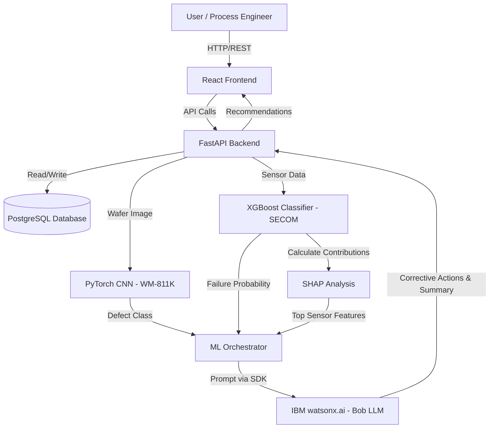

# Architecture

## System Architecture

Our solution utilizes a modern, decoupled architecture connecting a React frontend to a FastAPI backend, which orchestrates traditional ML models, SHAP analysis, and IBM's LLM capabilities.

## Components

| Component | Technology | Responsibility |
|---|---|---|
| **Frontend** | React / Vite | Interactive dashboard for wafer maps, batch monitoring, and root-cause visualization. |
| **Backend API** | FastAPI (Python) | Core orchestration, routing, business logic, and serving ML models. |
| **Database** | PostgreSQL + SQLAlchemy | Persistent storage for lots, process records, predictions, and recommendations. |
| **ML Models** | PyTorch, XGBoost, Scikit-learn | Deterministic classification of wafer defects and process failure risks. |
| **Interpretability** | SHAP | Dynamic calculation of feature importance for root-cause analysis. |
| **AI / LLM** | IBM watsonx.ai (Bob) | Generating human-readable summaries and corrective actions based on ML outputs. |

## Data Flow End-to-End

1. **Ingestion:** Upcoming batch data and associated process sensor readings (or historical data) are stored in PostgreSQL.
2. **Inference Trigger:** The React frontend requests analysis for a specific lot via the FastAPI endpoint (`/analyze`).
3. **ML Execution:** The backend loads the wafer map `.npy` file and passes it to the PyTorch CNN for defect classification. Simultaneously, the tabular sensor data is passed to the XGBoost model for failure probability prediction.
4. **Root Cause Extraction:** If the failure probability is notable, SHAP analysis runs on the XGBoost model to extract the top contributing features (sensors).
5. **LLM Generation:** The defect class, failure probability, and top SHAP features are securely packaged into a prompt and sent to IBM watsonx.ai.
6. **Delivery:** IBM Bob returns a generated executive summary and recommended corrective actions. The entire unified payload is saved to PostgreSQL and returned to the React frontend for display.
